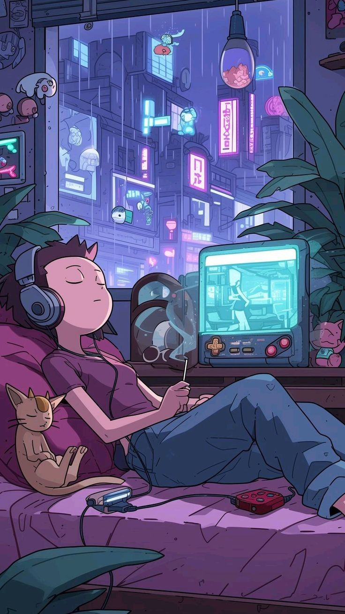

###

  
  

    <samp>
      i'm Vedant | 20 | he/him/his
       
      i like music, cli/tui tools & more
       
      experienced in Kotlin, c/c++ & Bash
       
       
      i play minecraft, im fucking awesome
      I develop apps and i use arch linux BTW
       
       
      currently working on NOTHING unfortunately
       
       
      twt: 
      <a href="https://x.com/VedantKhapre">@VedantKhapre</a> 
      contact: 
      <a href="https://discordapp.com/users/1091575419167314030">Discord@Cookie</a> 
       
      silly projects include:
       
      <a href="https://github.com/VedantKhapre/iBefore">Chat Application with Offline chat Translation</a> 
      <a href="https://github.com/VedantKhapre/Offline-Translator">Offline Translator</a> 
      <a href="https://github.com/VedantKhapre/Flix">Cli to search and stream torrents</a> 
      <a href="https://github.com/VedantKhapre/Discord-website-clone">Discord Website clone</a> 
    </samp>
  

 

###

  
  
  
  
  

###

  
  

###
  
  

    
  

  

###
